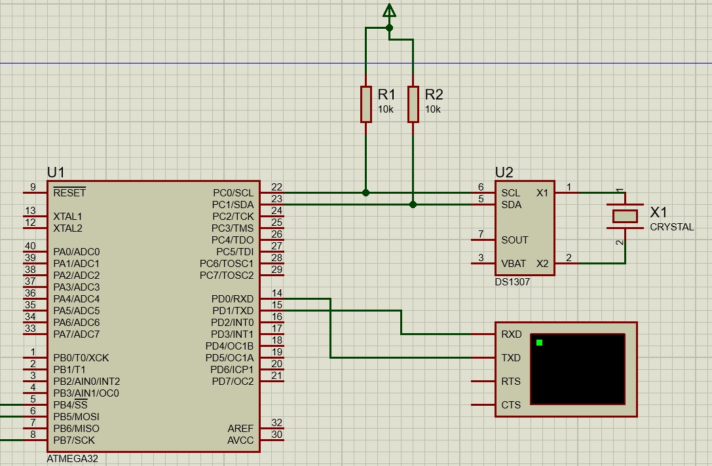

# Real Time Clock Interface with Atmega32 /avr_rtc.c


## Aim

Ability to interface the RTC DS1307 IC with Atemga32 using I2C communication protocol to retrieve real date/time information


## Purpose

To use the Real Time Clock IC in Embedded Systems projects where the real date/time calendar information is required as a feature such as digital clocks, data loggers, security systems, etc.   


## Components Required

1- AVR Atmega32 (Microcontroller)
2- DS1307   (RTC IC)
3- USB-TTL (Serial Monitor)


## Short description of package/script

Script Name: avr_rtc.c
Description:
main script where hardware components RTC IC and USB-TLL are initialized, and Real time is read from the 
RTC IC using I2C communication and is logged using serial communication through UART communication protocol

Driver files for RTC, I2C and UART are available inside the Related Directory where each file is well documented

tools/IDE:
1- Vscode
2- Proteus for Simulation
3- Makefile for building the project using avr-gcc


## Schematic


## Setup instructions

1- Clone the project

2- Connect components with atmega32 as the schematic above

3- Connect ATmega32 microcontroller with laptop through usbasp

4- Open the terminal and write:
```make all```

5- Code will be flashed to the microcontroller 


## Compilation Steps

Open the terminal and write:
```make all```

## Output


## Author(s)

Mahmoud Elsheemy
