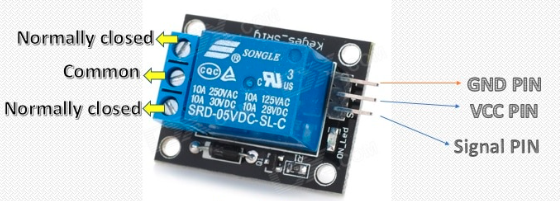
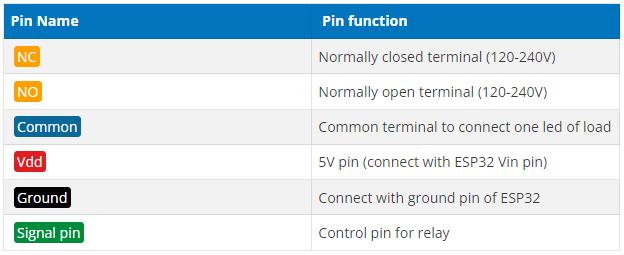

# ESP32 web server control relay and 220 volt lamp

One of the best projects, you can consider doing with ESP32 is to  **control a 220 volts lamp**  from a web server. But you can also use the same procedure to control  **fans, lights, AC or other electrical devices**  that you want to control from a  **web server**. This tutorial is about controlling a relay and 220 volts lamp from a Web Server using  **ESP32**. First, we will see how to interface a relay and bulb with ESP32 and after that, I will show you how to make a webserver to control lamp/bulb from a web page.

## Introduction to a relay module

Relay is an electromechanical device that is used as a switch between high current and low current devices. Its main parts are coil and contacts. We generally apply dc voltages to coil and connect load across normally open and close contacts. When we supply dc voltage across the coil, it starts to energize. When coil fully energized, contact shift from normally open position to normally close position. You can read these articles to gain further details on relays and their working.

-   Introduction to Electromechanical relays.
-   How to control 5 volts relay with Arduino

## Why we need to use relay?

Light bulbs usually operate on 120 volts or 220 volts power supply in case of AC main supply. We can not interface these AC loads directly with ESP32 development board. We have to use a relay between **ESP32 and lamp**. You will use a relay as a switch to control 120-220 volts lamps. We will control relay with ESP32. We will use a button on web page to control a relay. ESP32 will give signal to relay depending upon the button state from a web page. You can use any relay module. However, I will be using SRD-05VDC-SL-C 5V  **Relay module**. It works on and can be used to control output loads from 120-240 volts and current range of 10A.

### How 5V relay module works?

It consists of 6 pins. Three pins are used to connect with high voltage side i.e. electrical loads and 220 volts power supply and other three pins are used for low voltage side namely; vcc, ground and control signal pin.

### Relay module pinouts




As shown in relay module picture, it also has other components and relay in the middle of board. When we apply active high signal at the signal pin from any microcontroller like ESP32, relay contact move from normally open to normally close. It makes the circuit complete and load turns on.

There are two contact pins that are normally open and normally closed. You always use common pin and either normally open pin or normally close pin to connect load. Depending on NC or NO, you will use active high or active low signal to control the relay.

Normally open: If you use normally open pin, relay will activate with active high signal on control pin and active low signal turn off the relay as shown in figure below:

[](https://microcontrollerslab.com/wp-content/uploads/2019/05/5-volt-relay-normally-open.jpg)

Normally closed: if you use normally close pin, active low signal activates the relay and active high signal on signal pin will deactivate the relay.[](https://microcontrollerslab.com/wp-content/uploads/2019/05/5-volt-relay-normally-close.jpg)

So, you can choose either pin according to active high or low signal. Through which type of signal, you want to turn on or turn off relay.


### List of components

You will require following components to build  **ESP32 remote control relay**  project:

-   ESP32 development board
-   Relay module
-   Lamp
-   Lamp holder
-   Jumper wires
-   Bread board
-   Power supply connector

## Connection diagram of relay and lamp with ESP32

**Warning:**  Before making this circuit diagram, make sure you have not connected ESP32 and lamp with power supply. You are using HIGH voltage in this project, please take all precautions before making this layout.

Now make this layout on breadboard according to the connection diagram shown here:

[](https://microcontrollerslab.com/wp-content/uploads/2019/05/Web-Server-control-a-Relay-module-with-ESP32.jpg)

We will be using normally open configuration in this project. Because we want to light up the bulb with active high signal. To do so, we will use COM pin and NO pins of high voltage side of relay. Normally there will be no contact between COM and NO pins and lamp will remain off. As soon as we will apply active high signal to control pin of relay through GPIO pin of ESP32, relay will become activate and lamp lights up. In short, when we send an active high signal from ESP32, relay turns on and when we send active low signal from ESP32, relay turns off and similarly lamp turns on and turns off.

Note: Some relay modules have transistors which works with inverted logic. Inverted logic means active low signal will activate the relay and active high signal will tur off the relay. You should check your relay module functionality before using it. SRD-05VDC-SL-C 5V Relay module does not work on inverted logic.

-   Connect 220 volts connector one terminal with lamp one terminal and another terminal with NO pin.
-   Connect other terminal of lamp with COM pin of relay.
-   We will connect low voltage side of relay with ESP32.
-   We are using GPIO22 of ESP32 to provide active high signal to relay. Connect GPIO22 with control signal pin of relay. 
-   Connect ground pin of relay with ground pin of ESP32.
-   Connect Vcc or + pin of relay with Vin pin of ESP32. We are using 5 volts relay and it will work on 5 volt only.

Note: We are using SRD-05VDC-SL-C 5V Relay module and it works on 5 volt. If you connect ESP32 3.3 volts pin with rely Vcc pin, relay will not work. Therefore, I recommend you use Vin pin of ESP32 to supply 5 volts to relay Vcc pin.

## Controlling relay module remotely with ESP32

Now, we will see how to control relay and ultimately lamp from a web server. We will create a **web server to display web page**  with buttons and picture of a bulb. Web server will server the following pages. When you press the ‘ON’ button, you will see this web page on web browser.

[](https://microcontrollerslab.com/wp-content/uploads/2019/05/ESP32-LAMP-ON-WEB-SERVER.jpg)

When you press the ‘OFF’ button, you will see a web page with lamp off picture.[](https://microcontrollerslab.com/wp-content/uploads/2019/05/ESP32-LAMP-OFF-WEB-SERVER.jpg)

Now copy this code and upload to ESP32 kit. But before uploading coding, you need to make changes in ssid and password portion with your own WiFi name and password.


```c
#include <WiFi.h>
#include <WebServer.h>

const char index_html1[] PROGMEM={"<!DOCTYPE html> \n<html> \n<head>\n<style>\n.button {\n background-color: #4CAF50;\n border: 2px solid #4CAF50;;\n color: white;\n padding: 15px 32px;\n text-align: center;\n text-decoration: none;\n display: inline-block;\n font-size: 16px;\n margin: 4px 2px;\n cursor: pointer;\n}\n</style>\n</head>\n<body> \n<center><h1 style=\"color:blue;\">ESP32 Web server LED controlling example</h1></center> \n<center><h2 style=\"color:black;\">Web Server Example Microcontrollerslab.com</h2></center> \n<center><h2 style=\"color:Green;\">Press \"ON\" button to turn on led and \"OFF\" button to turn off LED</h3></center>\n<center>\n<a href=\"/26/on\"><button class=\"button\">ON</button></a>\n\n<img src='data:image/png;base64,iVBORw0KGgoAAAANSUhEUgAAAGQAAAC0CAYAAABi3Il7AAASXElEQVR4Xu1da7qjIAy1a3LW5F1TXVNdk/OFEAgBFBCQPvrnzrRWLYeTk4QQH9PvNdQIPIa6m4Ob2ffXjh9v0zSt+u/R3c/TNC36gHl6PP69xW8d9iYRABj8v8pzBkACgP6G/O1D3VQ7EDimwBwAml4A0DIMg4YAZN9nzYbKZMg+HYD1vBWcWwDxmSBnbfZIVvoC3Qfqzx1mrSsgCARoAjcZlcay6mn4BAHG9NObboDs+1ODUXXkOp2snylrDgiy4l+ngWt9GTBja9Mxa3ryfV92jBk+6dVWX5oBgmCAVoyuF+WT5fGYqo9f9RN+lok6A6u+tlQF5DNN1Bko01STKVUAeR939nxwy44ApkA65rrgVwJk2uGGPlkv0oC6HrNcAuS9Y4u0IXZzXuSgHDkq11zjYkC+S7wRFtCKtElYDkoRIN8IBppkAGVTY3YOTBkohYCMkp3NNTtXj5egQBaCFstCZixfU7IB2XcQ8G9+uaDQSMQD4VdWOj8LkG+NM8LTzzdJ4XUdcIfRzKW8kg88t5kpl/u0Y3yTFJ606aAkAfKdIp46eXyTFGZKmsgnAvKtIn4GCgbDMnUSn8DnenIKyE83zkCBz0MsgQU5Xq4Udgbk2Q8B+ZmqFDDgmLB7i6YLXtYlPktEngDyiQtMqYOcd1xsoP0w4VhLooCgV5VSIZh34597dIwloSXseMB4AMi3B4D5UyfOEt/SxI4NAvLTjnww8BthLyo8nmGWRAD5aUcZJHFTFE45+QBGAPmZq/qA+B4XrjK6aRUPkF+KpAwK+lZcR8KFgvL4ACA/dpRDEs5ZHReTu2brB0j56Ee+aQfYpuTd4NB+0S+6cwD5eVc10MH9JulF5S6rBCA/76oGJLnn4DoiAPlldXMHs87xliUCkJ+g1xng/LMQSwwg42wry/8xn/ENdAZ0Scsn7eF4V3h+gAyGHKZdPoAhfKMmLAS9a40xCntiFd5gk0kNOi2Jro/Xvu/zNk3bDO/KwrX32TAEwv5mgORXAsJUeo+6AIcho8cfZUBIXo+eOGUMGTn+OC+dyTGoY+99fOKmxXHrdeuCQcCNy5RlVEDabj0eV1dmAmQ8DTmrX+Jm6vWiXlr47r9/572xxmTJsAwJ72x9vfZg1yDg04OBkALQmGVOb8AQGNx5nqZtm6d5hjra89kvRR7OAawxQM2zjldqN0fLcS9Cxw7JEAz4tg07v6WYn9xhQGC2aZ5HKwQ0DBnH7d22p4nCW4ChBP2175tu+wGsG6cfi2HIOKKOgExs9tZrXyGXqLftNU3z3zQP049lSJMF5uo5zTPZd54sLItLwh7VrK8zUusoExiOwxBMGhIIscQg6gslGMMactROFsDAFrIW+Fwlqn088PRFcchY3d7AlMxz25nrsrD24JaeTzNEpa9V17dRUtWLdnNbuaUpLCwd1CvfG5Qh6Pa2ZUnr85fAwrK9o62pk42HWKF2Vzo891juLsI3MCBKbpt5QSOyA/sEr2OvqePA1e3zSxmA8aJ0VuSA6eiRXN9WDCHW1QW5RC/873iAjJM+sTdb39sa01zZ7DarXBwrFkFQauvIuAwJlJKO5mkhJDijISt7vSEzBoMjJRPJFkSLrUfTEUAEKq2e01Ihch/TXLnL1W+xP6RGmmODTTQq/hhR0G3S9E12UEEi8FqAqNgBj8pQJmukl9tqI7DHcDSzBUKMy7dXcm01WNYGxtNNn5/obUFqm9bR2wxr6VlPt0VjkDheTLJur2kpsv/EMOWzXWJZ6aCHvxfunxXp5DBaJyA+qPnub4sUTA1wQrVnb9V8xmZpc4S5dnBZAwoMekPdSg/aM40n7rhkm8OQOg5BLQjseeKlsgeAjBe5l+nIdZe5PiDxZ468UYu/ksIEWoxqtRRcClW8zV9CV9KxPK4cgbY1XiMBUthzkbAfbTtYOEEoN37yxORYqZKzqv5ThowYl1CSkJed0v5bXmeF4LUtJ0o3WhX69o7HEirExnJTTM9DsRtuwVW7cDUyFqBxAElpyp/EEGTJCG4wxhQboACpEBp9Nk2hiBqSJBopVpmYE7ukz/v0Iyv2fkdA7nWDyTwhIygNAgNP+9PdlgEKNLUPBI+9t2Q0DQy402SG3MsSWFtfJjP74V8qAwxDrRnBWWJAQ5u2zXNhHix9/sePTH9URQEg97AEhnxan5YCOO21iID1IsVw3lSpRCLTvNzlbeXtsc9iiGUJmYwaMyjlHFo7NBsUK5SIIzvIjIGZmmf6P9kyDcu86m1sKderd8yZmyuvlA3IPaZrnrYYQ7RGhLYmmFY02zQtNzAkF4xsk0Vo9g8W52mFmMIaIeVpWTZY99euLmq7RuJetJZSypS0mCN09iKGIEv6plQgGLQelpYPDQouPFlhIbCYL3ZDgFi22+sCIH0FXu0HPBp4HSACQ9DNlQzpGSDmCTlnSjEgyJJ+bWWPGGKidYo6DHOsI1a2/FtisvLc3CqibrWkX0EEMoR5u86go8kiYPAvpVmQLf1yWuXsKBZ1PjC9WGJjEasXUtiVZqgMCTNZZmNnj9TJNXZUAaSnGwwrhk5MGGCJit0ZQ+D+3oUdbwdI3GyxVIpgCICzLH0EvSTuqKohrulq7Qaz4FCZJmuWZMKRf9aPIekJxCNX4ZKX5QLSXuDRZPkaQu5wSNR7AVKDHdVMlvW62rIkZrKiAWO3TO91MacxrMYQFPe2FY/bCs1iQq6vbaDsBYYdRL0WO6ozpG2wSPksHewFNKS/ySrPWcV0pCpDEJB2KZUjL4uoI+OQ1l5WTXY0YQiC0kZL1hWqSCJJRCp2UBF7r8CwjmfF2VKdIe0AwUWqUPqE57LCkXqrOKQso9vF7XVd4DZmi5sslwU8/e5G6nAcLk7Vf9U2V81MViuWrCtskQ55Wabqp2su680Aqe0CU7E1ZXGxQI6qT+xaSatcFs0ESlLWN1eNGVI/cr83lwX6ZftAplQhlhjJJqLeJnKfJ/Sy/DiEGTG9LiK9rKuiTj0eqc/vtTWP7qJuAalbfhpPnbjlP/XT71CoBwxB5+GffphaCQPOvtOYIXXNFlaehOMQ80OhHMssUGFd4/XlW6iaXLBX6pbW7P9s4LtF6m3cX9xnPq1LNJdF5T/qOBEYwr5EbGBT+nqqthwo51uT9ud0Z00ZUtP9PVpTd7K9kOFVCUXujV1ZNcRMruoXr7Y7zBM9/7EU3ts0BAGpoSN2G0I4daKLHKgFc2Bpt7zpDAMk8dkkV4DqwJA68YhkiDIeonqRKt19k3WFIdajosdeXBnws+92AKRGGuWMIWjbbcbXX94tZwgGgPTskVZPbOioITUAwc5y/OWuqR+5vbTbqiQWIXOFT/ZpDUbTSN3GIjUA8TO93GS5QCFbbCkpEqesFMguzdKTfkqe8HNmpvjnzU1WLU8LS0ndCDzEElmX5e7OzS2Ww/UOWHTDtH7boLALQ2oCImeaFXVXM9zKxSsmCwWdHkb2ESarDiDWZMndUi5IVOMbEvV8DaH0ei9z1ZEh12OR4+0IvHIRzRKPV/D/+XsMOSA9zFVHQK7ntOR2BFthgrtxYx4YvZ8v6miu1APEVGOCtjmsbm4vmqyrgJDJOtgpZYJElyGkM3kMsf2sXlBFA1uwp815eGWO55RzbCcv67rrm7I/hH649MbQZOVpiKMfqp/zPP174NMkWr6aX4Bu/lppEEXq1MUBz+pv/KQAkYs6bdjJ0RAef+w77INvnVTsarLQbJUIu13H9kWdhNw3Y2FRB4bIjgOxuW7rrfbXa4cr9HB5u4k6AnK2H1H2vHJdXYotYmIeMlN2nzoFhNSwhryuGEAWEBWDzNv0r+AZvCWmraPJijEEgaDe7GSKvB8D6Q9nhqsjWdWJa8b4HmrsHuS/rGsMC1h0DNzLbvRCxSDiadQlA536nY6ASIbQAhJ2Dk15KUCc0h8Bgj4JZwY2F0hLmRBA3DzhwlQfQe9sslyG4FIr9b5KgUO5SqbdEk+1828raEVgkgoIfPXv78+ZpF/AEABimda0SRtBivQmEcjEw4AhHjs0wD1c3q4MgaeJYpUA2GiMfEd6xcDo5V3RWHTTEOVpaRcyx4S0Bi2kG3BNMFXkufUEpSsgyBLwjMagh2QFB//5fO4xsFpOkq6A8JnX8kednfsICGIGSgd6fx/LEGO24IeuWkvORq/S50cghCbKHWB0FXU+rlR0prS9sflKAUK5Gvo+OBA9yn7kfOtusoglj39YWgPmgEps+MCkEuNswL2JoN+QE4GAUA41xDsqRwNPMfjXdYy6XozAwGeAQEmmu17NgckBR64OSjBDLLTfwfwWZAugqh0cD9UtYl1VgAn3mDo5ahzX9WJ0w/sTonZVm4NvYQNes+bAgZEMCv1oWewQKn6IDZa6ND0FDlhhTCgwZPkmQBQSOgPCc1n4nqwWVDNXgeYGlQSYAU6bGzI78BcGWX2+7ztE3LAsSwXTEBshWKsOVrlLPk+Pv7XrpO16MTRZsJyrDJLzB9li0+TBGa0G160+Jx2CgQVd8v6qJVh2PefEBO5BXNSZJTcBovOxZh+Byc/qRu56oDBTiEDxRx+YOl53cSpuw/n1CPfE4HR+dllLp3vvD8gT0vC0eMcWpTxwjDuktUaAaAu07EIgx8cZ78jgz7R3EACnDT2MqUrUv8FkqR+v9UMNomCBGdgYYAQWEUg/OEQJ8lEmWGoWHBvSDn3+zuyAq3ZnCOrIonJaTnd9oyG0zVY32Q+ZKgOYOAdpk9QMdW5yHAh8OEgyx67hI4u/xcsCYdeBl/Z7mcjTY3KYfqjFLAmQ/pzOY8Y2ZJ7kej1XG+Z6Y+qAffhVXhY3O+ypLLG1EmdMEwX5KPgwQsYdCt8be/xtXa1I14sZtzeJHbQpqnQxS6zTc4+NM449Hgm9OdcMfkccQqLuWA4u4GTyBXP4BParhni7k8DTK6T7zL048Lb0ybnJWqC+99NzWRCorbF2SZROce24DSLJSyJkZLXKSVzCmamcBTYjFBCuKextrm70siBaF0GD81/uEgdYovAgV5c7a8SCkPerL2A8LoprqH+JdhJ0qkXd3zd4WZg70rbas+v0NC+aqSymkDNaAkpa4Aj5iceln3/oV5iy73UG5R5Rp8H0XFmpIyHvKxqOx3wq/32dXbb5M+5WCxA/HhCTeqdxCkTjxtaLqNs4QCGNcVMe8XQXD/6EiTMs0+fvDMYtGmKjdAr8WOrEpD0oWtcmzIvMuajLaD0UvfO+ApS41E8DJeSWBV1ek9P6pkidJxiNm8ki5hBDHBGXLqx91Cp7hp7v+vJzKNGmlArltO6N0m9hCAaHIOw6wWj8fz3rPS+IC71gzmlanmkQd2tVlpcYKljhxEZ9U+83AkJuLzclMUHnqQ32OGgpEl5Oy0+DuOrOruelukhDvin9DrPUieP4IhSbvV5qQzpNkSAy6nMJ8Xe7+7vB4XeIOiyp6kg95H6qiU1iLs1VIK6QXrATfYtdbAYkcZBzDh6DfJPJ4t4Mn6UyWOQ6QcGhzJBILywEkuN86UHn8ecEusL05AZ23KYhKOywJsL6IJqUBctnRdfR9VR3gGGelpOT4rEMj/zZMrIqbXVTKL2zvETe7pE6XVg91sIMAqvRMtUoTMClCTPr71q4JXDGvWX5Lsd7olwYASsaZN6Q5b0dEAMMLeeSu0vpFCdI5J6WaawYle3zDyRrmEd2Ixi3miwLiI5JYubHE3j6JisV8rT+IHo3jgT35MiR6L+GLifPbSZL3siuoncYSOrNGxlUE2/QegY/js4a0o3IipYCE89xl27wsRgHENIUkxIPpEO8jKEsoGPLvuS5yXovzjgu/jebqmE0xGMKpFUgTomlUEIxihF1ZoaMCaQkIr+SsHE3ubghrRuGIfzmlAcGLrEa1JTFc1YIEUqDGJdaDgF6d723HBw5HUMCQjesNl5i13e3Sp6bIcfltXqA55ARIoo3vAun+Fv7lvice383VS6m3BgcA5Xtf3//zNOfF5Utx24OSJzAurosJdWMwUYF27SqXcDT9Hw+va4NqffV8rihGQI/fFme+8qqVHDnkx5lY57IAdDZj1ixnR5J3f9kyN8+5E3JGbgsy76qqN5uVRaLu06ZydFGUgDj+Xw1fSjLFQa9BSB6U44FxKCB/5A6fgTIqKZqWLc3NrskS1RbStreJkxXDJBlWaZ17bvfI5ctb8EQ+lHzPJv+I+Y9hyPat3Iq2J0hGf73Dn+DfDjBDSYtCUQUJu4OMWR0U/V2JksCo7Y+4/4nrSHwf+wex/svgpnKaS6Qa2JqH/8f8TsYLbP4YsEAAAAASUVORK5CYII=' alt=''>\n <a href=\"/26/off\"><button class=\"button button2\">OFF</button></a>\n</center> \n</body> \n</html>"};
const char index_html2[] PROGMEM={"<!DOCTYPE html> \n<html> \n<head>\n<style>\n.button {\n background-color: #4CAF50;\n border: 2px solid #4CAF50;;\n color: white;\n padding: 15px 32px;\n text-align: center;\n text-decoration: none;\n display: inline-block;\n font-size: 16px;\n margin: 4px 2px;\n cursor: pointer;\n}\n</style>\n</head>\n<body> \n<center><h1 style=\"color:blue;\">ESP32 Web server LED controlling example</h1></center> \n<center><h2 style=\"color:black;\">Web Server Example Microcontrollerslab.com</h2></center> \n<center><h2 style=\"color:Green;\">Press \"ON\" button to turn on led and \"OFF\" button to turn off LED</h3></center> \n<center>\n<a href=\"/26/on\"><button class=\"button\">ON</button></a>\n\n<img src='data:image/png;base64,iVBORw0KGgoAAAANSUhEUgAAAGQAAAC0CAYAAABi3Il7AAASkElEQVR4Xu1da5qjOAwkZ0rOlD5TcqbOmdjPBhGh6OkXTGfnx/ZOMMaoVFWSIT2X6f8/p4rA5VSrcS7m9/d3tobebrd/8t5OvegU+BRYCgB8Zv2UQDszWKcEBADAYFjBp8cBDOk8DNaZADoFIJwEcWBYMiWBQD9Pf+cAPAMwhwJCmaBlcw+GaKzygt963HBAJD/gslj6zAIHM4D+f+Q6cG7roGvzDQWkJSO0m5LkTpIpWjwcKWdDANFMWtN3GvSIyVsssUCT1tWbLd0BkbKPM9bSgNPS2Aq2xhRrXb1lrCsgml9w/YWU1VovQstXi43WXNa6KNitGdMFEAyER7etjNXKWetcL1s0Zlj30BKU5oBEM9QjNyVB1TzEAlGqzEb4SjNAIkBYZavmJZ4y1gLQkjlrfdwaWjWVTQDxGLdV9WgVlVaJeYIfAdjyEIt5tfJVDUgNGJFMLA1q7XnSGnsBUwWIt4qSspgzUqsv8XiOh40lzIK1WUlYw5JiQPCiSm5O21C0TLc0a61AWj5IexCumsQJVQJMFSAWba0btALvnb83q7gEoMGW7jUKShgQKStKWaJpfGROa6wFvvd8qVPXFCMCShEgtTqunR/J9kiQvWzT/I6bAwdbS1YvKCFAtA7cyjApIDV+YPUTXNFQu046Jxdoble7OSCWH5RkttZ7RALnGRsBz8smSb7S51wF6gHFxRALjIh0RHoPT2AsMGoZ6PG4NIYzeU8xQM9zA2LdeIQh3FhP8OkY65qtrkM9z/ISuG4JS0xAIlWVlymerPMAZCVJq+twXuTxEpAuug5NulyAWDfOZa51jlbNWOdaAfIc9wDuHaN5CQWFkzcMkApItLP1MoQz2Mi5HgmRtnVKr2MliRboiHSJgJTsU0UqmUhQPcHQCg/uWt7st67dWrpUQKIVSu34miBZgWtd3UkyLfmDtzcxGRLJ5IiXWBWSFeDSiit6XmQdlmzRWHLjWUC89LeyzroZ63iUMZ6qShsTvZ63/MVlMBcz09Q1M/dkWMRLWgRB2wa3Kq4eSWHJFlYHOpbtMDU58fiEZ0xLICymSgnSWjYlyeL8A3+mMsRb6moBjXhJ6wylGaeVuT2ujUGRtuS1yqzYQyJ63evGpczzMLT1mvA1U8BpYkvSCZ9DIu0A8WyTROg/0ks4+YmstQYgyTMsEAA0t2TVssCTqa28pHatNevwehgnn26GaNnF1dNcqeypyGoy07MOOqaHkXsfT1igp+MfkmWh7cn6kUaqXYsG3xrbKjki81Dv2QCxankp2yMsiCzUyiaP32ky5p2/x5o51kJ1tgOkRIc9jOlp7pGsP6NcmQyxssqqXKTM65FpUs+hBb7HOmrmpJWYyRBLhz0MqVmwdi4FhJaRVofcyoxL5pGY/eEhHoZI1Y0UvFq9plmk1f3csZJnO72SSPO+rcrybJdoTLA8IqLzUkJEQZDGl2RzbUJ5vBmukRliLZLTZJq11g5xjaG2AgPmKa3QWgLDJXECbgPEoqjEEC37Pf5i3WRrMDAo1j1ba7MS2cMMOsbFEK5ulgIl+UuEIRCIXmBQpowEhoKsVlmejLCYokmZ10vSuAgYkbc68LzS9nhPgCzVKGKINSkNEJcVGvgaQ6S5aaCpRnMAH1l9cR6SPiv2EO4GS9gjAQMs4XqJCHvSWK7goJ/3ZIVHNWCMiyGa/nMypOmkRxY92R0FxWJQiUF778Xrq1uVBdmiZau1YE8WeLKwNxj4XiXZ8KyzZgwXqzBDrAVIlRj3uTUXlxg1jKDnehrhkuwvuS+a6KqHeKsiKmme3kS7YS1zS4HhioGjgq4pkbqXVbvg2vO1jPMAw3XkHia3yPTSe2d3e71lrbXwCMOigfIAIpmpte7SYFo+a12XNXXpRq3JPBJUMwd3bmmZTSX2KAC463ZliFZNWNnkqYDoDUWrxLMBk9YjeohWO7fO9FYZKq2LC3yra7aeR3xiyGX3SCA8DNFkzMPO1sG0WO8pUtg3F7VMGwVKCUM1CSqZb9S94nWHHuGOWmBN8CzZokXLqHuy/C2t48NDPDfT+wZ66X2a94wvPQBQcN/im4uah/QERepHavWeq8hq52wVBwyK6+33kTfjMeOaQJyt1KWvLrHfoJIarp7BotekWt8ikC3mqEmGcJWFddZbsbRaoGV6NfLSao295sHJF2ZIryzjGML5STQoHNOic4wYz5o6fEifF1AQeiwQB87b8HlYc4aeylqnyhAqWx4/sS6odbDe+Vsws6cHlsaAMlj80qfVk7RiCVfBaY1hyY1zYJbM0+qecRK6AAGWtJQOy7QlpkjgRIMjyW50nlbjIR4hQEZkkeQdns+969PGeedoBYTGjrQW128D6rFoixFaX2JVZJFzWwc6EivKDhUQbO49Fs15h0frvTfMMYwro73ztYqBJFWwXvMd2po9/pLqymIOB5rldTjonvlbBV9bVzoWZgic0AsUuiCrutLGe/sNzZt6AkGTggPDlKyesqX1H5KMRAOmyZZ2/eh1IuMlZrglqxdLOBnx6rmUXSUeJDEmEmTvui0wXAwBlvRYYE0w8Lmv12u6Xq8sTpZnjGRKM0BGSJc3y9I4AIADQjvmqbK86yhJUIvZbobgiVoafPSmvKzAoEmFgMWc1sB4wAgD0hIMTu+1SgnGU1ZockWB8VZx0USxKjwvGGFAWksXzVItKzV2YFA0yeIKiZ5MwXN7QTEbQ26iVt/zjpp6DTuka1mf17AFEsALRhFDYPKaL72UVDYehljs8DCEG1PqJxEgYGwxQ1pkTpRpUYZ4PUTb4igFg75N4gWnCBDwklJQorot3YzkHWm81ZfQObmSuPT+SqSqiiFYtkoyqFS3vebNjdNY0IMhXkbQccUMwRN5y2GPd3hKX7h2DUO0Cu8IZjRhCEiXlyV0nOc8qbvW+g8OKO7apUy1APNskUgMOgVDLFbAccnUaXVVsrd1dHXVjCERgy/JSIkhtILCMkZNnZOnlgBgyS71jqaAWNIV8Q6re8c3LElThCFSkliyxMltLRjp/CaSZbEk4h0WizRDB9ZghgA4VoCt416/qwWlGSAaKJG+Qxv7eDxm3F9ITJA+t4JuHbdAqQWjKUOwbGkVjdWAWWziJMtj6p5gw9yesXRMCzCaA0JZUuMdkhFLHqJ9HglwydiaMpcC2VSyYHJpj0qjfJRVWlPIeYglN9F9NcymVuzowpCIl+AgeXyG3njEQ6zqzcNmab2nB0QDBS9e6zG4jNZMXSqBLU/yNqXSPC3B6MoQKfBSpkr+o0kZ9/wjfYYlixp1iUdIctfSO2CdXTwEewkXACsoVtam+TW5kjyEguP1FW29/wRDINu5AFhB8R6noGiSBYHH67KSwgPW1zPEeh4SeYTrCbg1pjU7unkIXmj011l4Mhfm91ZZ3grLA0Dpo1kveN09RDJlyyes4xpbvE8MLQDoLm7LXV0JoK6AcJptMcACAt8IxxCpyooEX2I1Zpo346PjugIivSpUAko6p7QPqQFDKjKigfaO7wqIVNV4KymrcYz0IdY1rdJ2hFwNM/WWvYinkvrfQww+tpAu7hLRt04sqeSkDa7bu7qC63SXLCxbtRWX1Ydo5XBp6auB5PWFyLghgAAotdJFb8zDkNKnhwAEZgj9LBJo79ghgESfNWhb4RoLejAEtkf+nGRF9dvyjHRcenRrvSjnXQtew5+psjjKl756qkkWPsbJFC2hPaCM9o8hZa/Ui1gB4UyYBtrjIRgor7FzHfn/koUiyTWI2na79+mhtk2Dt9ZHydU/xxBLsrSm0WIkV5KPNvRhgGi9iJWluEKTJIsyIl2P+8JOBJQ/zRBs7FZQLJ23zBtXX/j/retKBo53GTBI3r4iOm5IH+JlCCzeswXvfR5CA+IFhqsOo8EtGT8UECsY1nGtysJNISdZ1txaiTuqwhrqIcCSksBgH5EkS6qs8OfaDgBd159niFe2pBIXsl56BgIm7n09SNtXo17xJxlidec086n+Sl9zlnQaAyeN0b46zSVQiSdEzxnmIfgGpS7cs/gURM8elgUwd60095HsONxDoCz1AMEZtXQ+Bq3kGkf1IIcAQqshLxjRcQBK5DzKkJFbJrDO4ZKVsi+9PRIJ1IixZwDjMIbAu1MjAm1dA4yd8w7wqhEd+iEMAWM/CyCciUNg8Dtg/wNipXXlcQ2I5Bv07cc/D8gRPqKBwDFXkrLKXDBPH2rqsJrf33m+3S4XnI3mSgsHeIDApTEGYmSHfpiHpAvPv7/zdE0vKUy5EaPPPCKxtwKO59KuA0CkX8f8ul6na1rcdZouF/6X5kfWGBk7nCEZjOmZHiFNl9vPJbFlml4fwEQaOmtbhSsi3udcp+v1Nb1eqUu/XH7neb5Or2l6PtNTrrzGSEBrxw69GCx2flznnH7w68HTz9eSmbdLkrIFpPSH22ykNx3dSsHn50u/FlAyZdcvjebrX+/fBEgKSwJl/UmilKRityGZMjeDlv7zHvyxL7bKDchO+pmCnMfN85wAn3/n+XK75GRcGJv+PNd50eSJxT/PoUk79GJLAKBLX28c7j+zJf0F/yRcyMFNMrIEM/0B402Bvdxul4+f8++8AIgDDWcDuNyxdcxglhwEyBr4bJwEiFdiTabC8hMAon/XgPsQcnw9wEYBYcfWx5SArvUG7/nDLvT2j/siEZtUKeBAKYZBAxAxmByxdvEWgn+9I8BToQELW8dnU/8GyXotVdY7yVeWSOz4AGaNHQABx/PHGB2al9Sz0nU57wBsxrIjXXU4QxYfuc9LNYPkyitdOfjAMEba8nHIdghsug78gy8AfpqEMgfGAEO+pcpKxr42XnuZWLtFzuAzCBiA3MGtnyFsWfOmBcPOJNYlYKDg+FdVWVh2aKAZC9zF1GPIcAI3F2HLVjh8VmOXn9dQFRl6sUWuNHasLEBV6cIKb43CeMY72fcSCYyj/kSk9Dv6EDB1Rjmy1n94BMrcrW9h2paPaguzhBQOG+hLR778wZ36NE33xxfsZaVG7fkjaFJ+S5qYLQQSju3oQ+bZkESfo8+wb2X/wcM+TX60XB1YZaVunZSnW1+BjB3LypbBqIeBANPyl/XwdVAGHA3IbEW0W7davmYva9k7WqWB/tuDu849IQDgQEWFCYHZgIoCsyHEpTacRwiFTev7tk6QF+wyFwwe9QY52ASIEr9fd5d32zZbWU0qiD8PyLb1vjLgI+mNXiNjgoPG6NMWcIJfvhZu/rA/IUYCQwaDcYiHvLt0FJzdv5pKd3s5acJMoaUV7d7fBdSCxVpGY69IB+739XkI6vK/AZAUkvmBNhi3un8NXMYDd+DIR3aShnaKxZ1gqnBo3vwACgwe9rT2zBvdgxzCkAzI9hgXWIKeS+SegPoE9CYk++n2/W4HGG/fg8y996gW+EGyyN4XyOj1azYXUdnLPRP5qK4c3SAugTdf0lp8XG3RTWIA7pu23xMTuIzeyQ/yiq0KomUVZ/Ba6YUaz02ywGdIc/gNHpLl6rV26lz5ubztgHZxme0PqR3hcOCa932LThQSAfxVkrV7ZoHKrN3WO1RF8DALjJgpZzcG4QdfpOHbVGoNOlbCafUuWNcB7DjM1BdjT7u+uMRcq6ntSaKTJXjbhHtauEkgMnFcNcPrSOk9LLSFckSFdSwgeZMRgoDe0WLfPEFbHJt5w+bgigh91k6fuWM520pr8A5SZR2wywvLG/48hMr81iiCwe4Ci3qSXZkKKa6Zt9PYd537MVvueKUnAGR9tZSVnp22oKoMAcJWtkz3Dj0H3lbZGs21TznIN04FCCzm/XrpqvU7aULbHaDz2/MMHPyto9tvqX/IIDoHbVge5RvnBGTzlHV529a8tpeFJW33tGktnTHDGK/B2+wH+sYpAdmYsj1RhPJVqLY+3myEnRDYMoHSGKo32rygv59Aqk5j6pz1zvl93PVlOrqvxW0kfhQC5LWgbWeXXm2p7kZ/5UArNw43dW1x+YuX0+v91ulHh03e//1435d5mPV6ZYgThj/Psa/4eGrCUwOS3mz/ud0Wjlyv0z3vll9z2LNjQObvtuzJSxLrX5+reT8TIK9pejwe08/P2C/j/POApBu4Px7z8+f9lsr2zadtG4R4RH6TdPk6mvQ+1/pbHk6ZjKdcFM2k+/0+P3NXD79LMbFkkR7uj/Y9+ATG4/Gbv77mydjRY065KBqE9Us5b0C27F/+561YC0waIGeVqlNXWVxWUpYACAtN9vokAXK/36fnc+z3PaIM+ycYsvXf12v+LQv4W7c7YOCJ7O6tlF1ITn+/p18gDmcqg8FLPjuKt6twDDm7VP1zkkWBWba6Xus33vf/UgJmUZKpyC8XiEpM6/H/AXpoFmnISz9wAAAAAElFTkSuQmCC' alt=''>\n <a href=\"/26/off\"><button class=\"button button2\">OFF</button></a>\n</center>\n</body> \n</html>"};

const char* ssid = "PTCL-BB"; 
const char* password = "5387c614";

WebServer server(80);

void handleRoot() {
server.send_P(200, "text/html", index_html2);
}

void handleBulbOn()
{
server.send_P(200, "text/html", index_html1);
digitalWrite(22, HIGH);


}

void handleBulbOff()
{
server.send_P(200, "text/html", index_html2);
digitalWrite(22, LOW);


}

void handleNotFound(){
String message = "File Not Found\n\n";
server.send(404, "text/plain", message);
}

void setup(void){
Serial.begin(115200);
pinMode(22, OUTPUT);
WiFi.begin(ssid, password);
Serial.println("");

while (WiFi.status() != WL_CONNECTED) {
delay(500);
Serial.print(".");
}
Serial.print("IP address:"); 
Serial.println(WiFi.localIP());

server.on("/", handleRoot);
server.on("/26/off",handleBulbOff);
server.on("/26/on",handleBulbOn);


server.onNotFound(handleNotFound);

server.begin();
Serial.println("HTTP server started");
}

void loop(void){
server.handleClient();
}
```