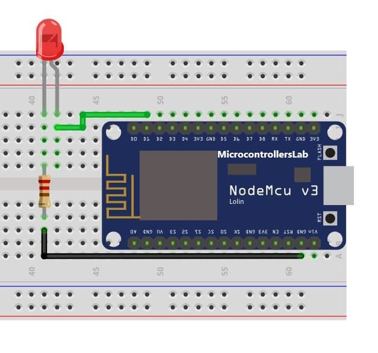
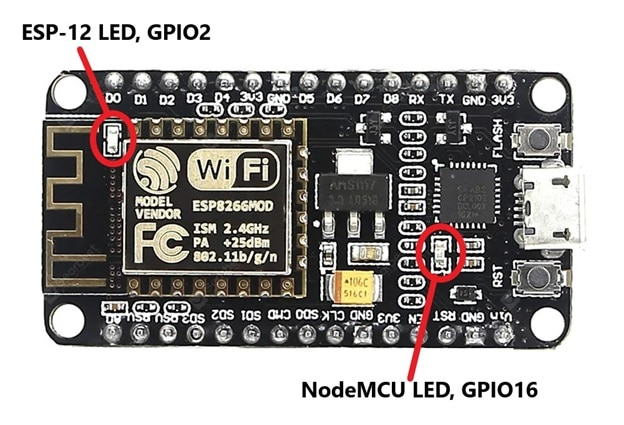

# LED Blinking using ESP8266 – NodeMCU

## [Video demonstration](https://youtu.be/z69-2bA9SzQ)


## **ESP8266 Pinout in Arduino IDE


Keep in mind that labels on NodeMCU silkscreen and that use in Arduino IDE are differed from each other. Consider the following table and the NodeMCU picture to use the right number of the pin in your sketch otherwise you will face the problems in using the correct GPIOs.

**Arduino IDE Pins Index**


### **Components Required**

-   NodeMCU ESP8266
-   LED
-   Resistor 220 Ohms
-   Breadboard
-   Jumper Wire
-   Micro USB cable

**Connection Diagram NodeMCU with LED**

Make the circuit diagram on bread board according to connection diagram shown below. Anode of the LED is connected to the D1 pin of the NodeMCU, the cathode of the LED is connected with the one terminal of the resistor and another terminal of the resistor is connected to the ground pin.



## **Writing sketch for blinking LED**

First of all, we define a variable named “LED” with integer data type to assign the GPIO we want to use, in my case GPIO5 which is labeled as D1 on NodeMCU silkscreen.

```c
int LED = 5; // Assign LED pin i.e: D1 on NodeMCU
```

In void setup ( ) function, we describe the status of the GPIO pin because GPIOs act as input pins by default so we use the pinMode function to change its status.

```c
void setup() {

// initialize GPIO 5 as an output

pinMode(LED, OUTPUT);

}
```

In void loop ( ) function, we have to use the digitalWrite function to On and Off LED and use delay function to keep LED On and Off for one second.

```c
void loop() {

digitalWrite(LED, HIGH); // turn the LED on
delay(1000); // wait for a second
digitalWrite(LED, LOW); // turn the LED off
delay(1000); // wait for a second

}
```

**Complete Code for LED Blinking**

Complete code for LED blinking is given here.
```c
    int LED = 5; // Assign LED pin i.e: D1 on NodeMCU
    
    void setup() {
    
    // initialize GPIO 5 as an output
    
    pinMode(LED, OUTPUT);
    
    }
    
    // the loop function runs over and over again forever
    
    void loop() {
    
    digitalWrite(LED, HIGH); // turn the LED on
    delay(1000); // wait for a second
    digitalWrite(LED, LOW); // turn the LED off
    delay(1000); // wait for a second
    
    }
```
## **Built-in LED blinking of NodeMCU**

To blink the built-in LEDs we have to only connect NodeMCU to the computer using a micro USB cable. No external component is required. 



-   On Board LED for ESP8266 is connected wtih GPIO2.
-   For NodeMCU it is connected with GPIO16

### **Code for Built-in LED Blinking**

This code is to blink built-in LEDs of NodeMCU. The on-board LED of ESP8266 is connected to GPIO2 and ths LED on NodeMCU board is connected to GPIO16. Working of this code is same as we explained earlier for external  **LED blinking**  with NodeMCU.
```c
    int LED1 = 2;      // Assign LED1 to pin GPIO2
    
    int LED2 = 16;     // Assign LED1 to pin GPIO16
    
    void setup() {
    
      // initialize GPIO2 and GPIO16 as an output
    
      pinMode(LED1, OUTPUT);
    
      pinMode(LED2, OUTPUT);
    
    }
    
    // the loop function runs forever
    
    void loop() {
    
      digitalWrite(LED1, LOW);     // turn the LED off
    
      digitalWrite(LED2, HIGH);
    
      delay(1000);                // wait for a second
    
      digitalWrite(LED1, HIGH);  // turn the LED on
    
      digitalWrite(LED2, LOW);
    
      delay(1000);               // wait for a second
    
    }
```
## Author:
[Adithya S Kolavi](https://github.com/adithya-s-k)