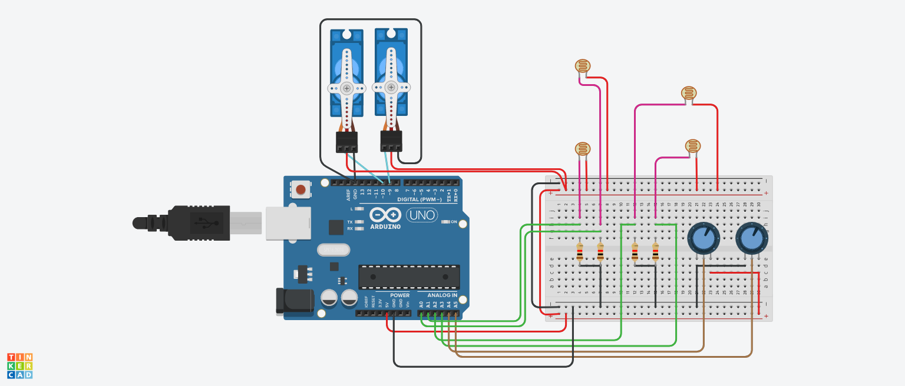

# Dual Axis Solar Tracker using Arduino

## AIM:

Implementing Dual Axis Solar Tracker using Arduino.

## Purpose:

To implement Dual Axis Solar Tracker using Arduino.

## Short Description:

**Requirements:**

- 1 Arduino UNO
- 2 Servo Motors
- 4 LDR(Photoresistor Sensor)
- 4 Resistors
- 1 Breadboard
- 2 Potentiometer
- USB
  (Tinkercad can also be used)

## About the Solar Tracker:

In this solar tracker, we are going to use some Light Sensitive Sensors like (LDR) to track the sunlight and direct the solar panels towards the areas that increase its efficiency.

## Workflow:

- LDR Works as a light detector. It is also known as a photoresistor. Actually, It is a light Sensitive device.
- As we know, resistance decreases as light falls on it.
- In this project, we are using 4 LDRs to detect the Sunlight.
- Usually, when we increase the light intensity on the LDR Sensor, the signal is sent to the Arduino.
- When they send Signal to the Arduino, It will guide two Servo Motors to better place the solar panel to maximize its efficiency.
- Using the two potentiometers you can control the speed of Servo Motors as well
- Thus, we can create an Dual Axis Solar Tracker using Arduino.

## Setup instructions:

- Assemble the circuit as shown below.
- Make sure to connect one end of the LDR,potentiometers,resistors and servo motors to ground(i.e. GND)
- Upload the code provided [here](./dual_axis_solar_tracker.ino)
- Run to see the project in action!

---

## Output:

[Simulation Video](https://github.com/shreya024/IoT-Spot/blob/main/Minor%20Scripts/Arduino/Dual%20Axis%20Solar%20Tracker/Images/dual_axis_solar_tracker.mp4)

---

## Author:

[Shreya Ghosh](https://github.com/shreya024)
