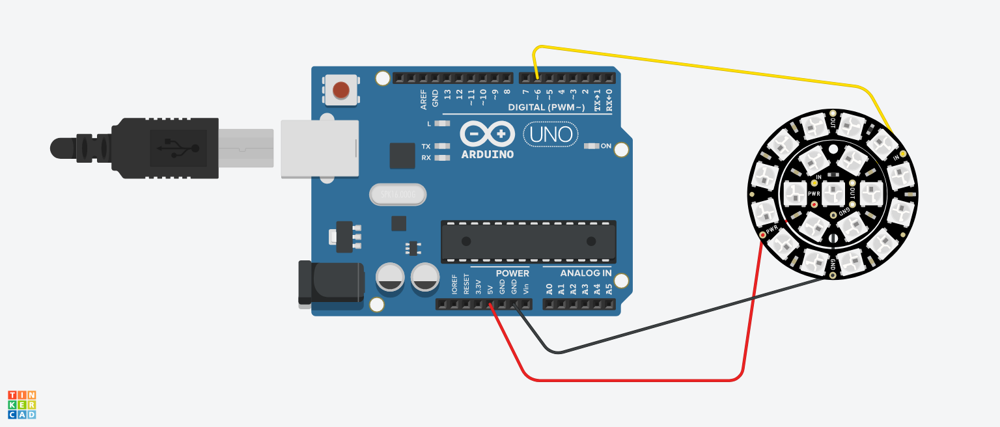

# Mood Ring Light using Arduino

## AIM:

Implementing a GPS Locator using Arduino.

## Purpose:

To detect the location and direction and displaying it on the LCD.

## Short Description:

**Requirements:**

- 2 Arduino UNO
- 1 NeoPixel
- 1 LCD Display
- 2 Resistors
- USB
  (Tinkercad can also be used)

## Workflow:

- The first (right) Arduino is the one that sends the initial request, and then uses that information to display on the Neopixel ring (and in the serial monitor and LCD Display) which direction the broadcast unit is in relation to itself based on cardinal and ordinal directions (N, NE, E, SE, etc.), or, if you’re directly over/under it, it’s labeled “Found.” The lights show up green for a direction, or blue if the unit has been found.
- The Neopixel Ring is used to detect the direction and location of the second Arduino.
- The second (left) Arduino board represents the unit that broadcasts its current position when requested.
- The Direction and Location is rendered on the LCD Display connected to the first Arduino.

## Setup instructions:

- Assemble the circuit as shown below.
- Make sure to connect one end of both LCD and Neopixel to ground(i.e. GND)
- Upload the code provided [here](./mood_ring_light_using_arduino.ino)
- Run to see the project in action!

---

## Output:

[Simulation Video](https://github.com/shreya024/IoT-Spot/blob/main/Minor%20Scripts/Arduino/Mood%20Ring%20Light/Images/mood_ring_light_using_arduino.mp4)

---

## Author:

[Shreya Ghosh](https://github.com/shreya024)
