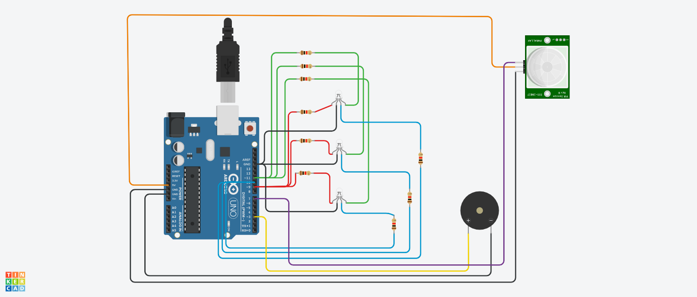

# Motion Controlled Color Changer using Arduino

## AIM:

Implementing Motion Controlled Color Changer using Arduino.

## Purpose:

To implement Motion Controlled Color Changer using Arduino.

## Short Description:

**Requirements:**

- 1 Arduino UNO
- 1 PIR Sensor
- 1 Buzzer
- 9 Resistors
- 3 RGB LED
- USB
  (Tinkercad can also be used)

## Workflow:

- When the PIR sensor senses any movement in its range, then the high sensor value sets the buzzer to ON state and, the LED will glow in blue colour.
- When there is no object in the range of the PIR sensor, the buzzer stops buzzing and, the LED will glow in magenta colour.
- Thus we implement a Motion Controlled Color Changer using Arduino.

## Setup instructions:

- Assemble the circuit as shown below.
- Make sure to connect one end of the resistors, buzzer, PIR sensor and RGB LEDs to ground(i.e. GND)
- Upload the code provided [here](./motion_controlled_color_changer.ino)
- Run to see the project in action!

---

## Output:

[Simulation Video](https://github.com/shreya024/IoT-Spot/blob/main/Minor%20Scripts/Arduino/Motion%20Controlled%20Color%20Changer/Images/motion_controlled_color_changer.mp4)

---

## Author:

[Shreya Ghosh](https://github.com/shreya024)
