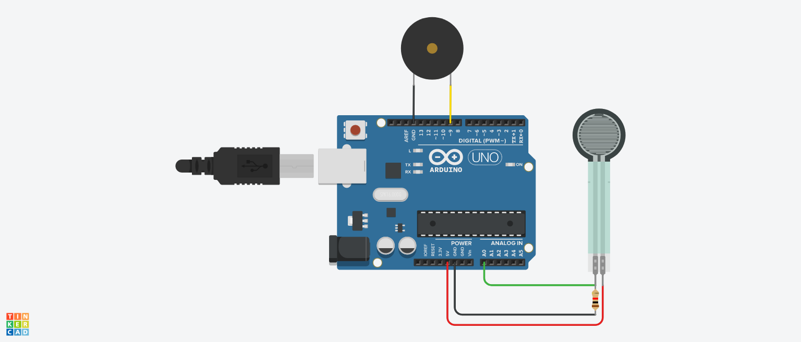

# Portable Weight Limit Checker using Arduino

## AIM:

Implementing a Portable Weight Limit Checker using Arduino.

## Purpose:

To detect weight and raise an alarm if it exceeds the weight limit.

## Short Description:

**Requirements:**

- Arduino UNO
- 1 Force Sensor
- 1 Piezo Buzzer
- 1 Resistor
- USB
  (Tinkercad can also be used)

## Workflow:

- First we initialise Buzzer as digital output and Force Sensor as analog input.
- We initiate a loop
- Using conditional statements we turn on the buzzer when the value of the Force Sensor exceeds threshold.

## Setup instructions:

- Assemble the circuit as shown below.
- Make sure to connect one end of both LED and switch to ground(i.e. GND)
- Upload the code provided [here](./portable_weight_limit_checker_using_arduino.ino)
- Run to see the project in action!

---

## Output:

[Simulation Video](https://github.com/shreya024/IoT-Spot/blob/main/Minor%20Scripts/Arduino/Portable%20Weight%20Limit%20Checker/images/portable_weight_limit_checker.mp4) 

---

## Author:

[Shreya Ghosh](https://github.com/shreya024)
