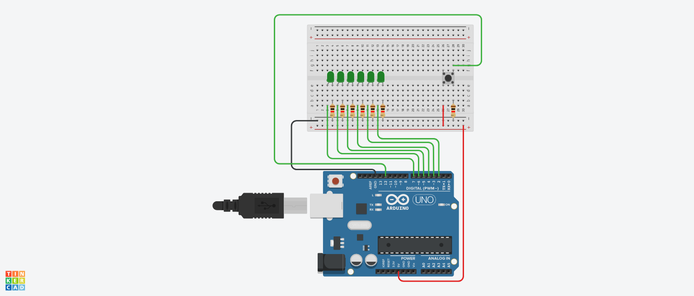

# Random Dice Thrower using Arduino

## AIM:

Implementing Random Dice Thrower using Arduino.

## Purpose:

To implement Random Dice Thrower using Arduino.

## Short Description:

**Requirements:**

- 1 Arduino UNO
- 1 Breadboard
- 1 PushButton switch
- 7 Resistors
- 6 LED
- USB
  (Tinkercad can also be used)

## Workflow:

- The number of LEDs are set in a row that represents the number on the dice.
- After pressing the button, a random number between 1 and 6 is generated and the corresponding number of LEDs are lit up.
- Thus, we implement the Random Dice Thrower using Arduino.

## Setup instructions:

- Assemble the circuit as shown below.
- Make sure to connect one end of the resistors, pushbutton, breadboard and RGB LEDs to ground(i.e. GND)
- Upload the code provided [here](./random_dice_thrower.ino)
- Run to see the project in action!

---

## Output:

[Simulation Video](https://github.com/shreya024/IoT-Spot/blob/main/Minor%20Scripts/Arduino/Random%20Dice%20Thrower/Images/random_dice_thrower.mp4)

---

## Author:

[Shreya Ghosh](https://github.com/shreya024)
