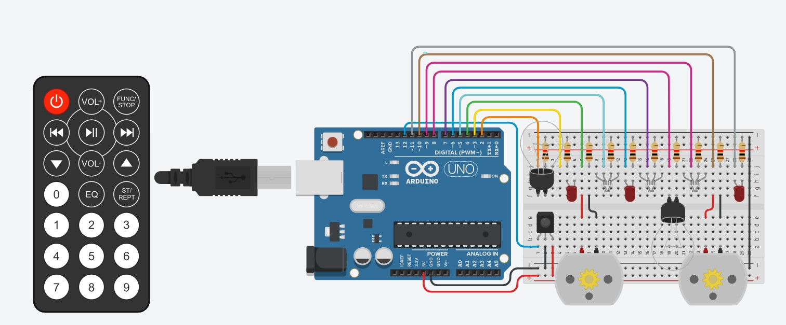

# Remote Control For Home
## AIM:
Remote Control Home Simulation using Tinkercad

## Purpose:
To Start the Particular light Bulb and Fan Of the Home Using Arduino.

## Short Description:
**Requirements:**
- Arduino UNO
- Led Bulb
- Fan
- IR Sensor
- IR Remote 
(Tinkercad can also be used)

## Workflow:
- First we initialise Signal PIN, Voltage and IR Pin.
- We initiate a setupPin Function For initialising the Button.
- ToggleLED Function to turn on and if it is turned on then it will be turned Off.
- Switch Case Statement For Initialising the Function of each Button

## Setup instructions:
- Assemble the circuit as shown below.
- Upload the code provided [here]()
- Run to see the project in action!
------------
## Output:
[Simulation Video](./Images/preview1.mp4)

------------

## Author:
[DragonUncaged](https://github.com/dragonuncaged)
