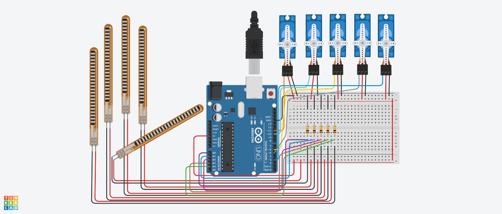

# Robotic Fingers using Arduino

## AIM:

Implementing Robotic Fingers using Arduino.

## Purpose:

To implement robotic fingers using Arduino.

## Short Description:

**Requirements:**

- 1 Arduino UNO
- 5 Flex Sensors
- 5 Micro Servos
- 5 Resistors
- USB
  (Tinkercad can also be used)

## Workflow:

- We use five flex sensors to indicate the five fingers of the real hand. They can worm using a glove in real life.
- We use five micro servos to indicate the five fingers in the robotic hand that mimics the real arm.
- The five fingers in the real hand are attached to analog input pins of the arduino.
  - thumb to PIN A0.
  - index to PIN A1.
  - middle to PIN A2.
  - ring to PIN A3.
  - pinky to PIN A4.
- We initiate a loop.
- The five fingers in the robotic hand are attached to digital output pins of the arduino.
  - thumb to PIN 3.
  - index to PIN 5.
  - middle to PIN 6.
  - ring to PIN 10.
  - pinky to PIN 11.
- The value of the analog input from the real hand is mapped to the robotic hand.
- Thus, we can implement Robotic Fingers using Flex sensors, Micro servos and Arduino.

## Setup instructions:

- Assemble the circuit as shown below.
- Make sure to connect one end of all the flex sensors and micro servos to ground(i.e. GND)
- Upload the code provided [here](./robotic_fingers_using_arduino.ino)
- Run to see the project in action!

---

## Output:

[Simulation Video](https://github.com/shreya024/IoT-Spot/blob/main/Minor%20Scripts/Arduino/Robotic%20Fingers/Images/robotic_fingers_using_arduino.mp4)

---

## Author:

[Shreya Ghosh](https://github.com/shreya024)
