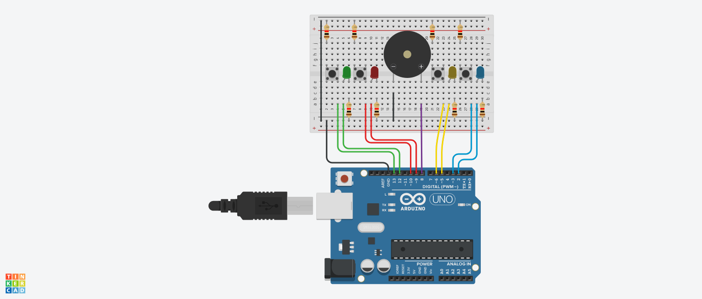

# Simon Says Game using Arduino

## AIM:

Implementing Simon Says Game using Arduino.

## Purpose:

To implement Simon Says Game using Arduino.

## Short Description:

**Requirements:**

- 1 Arduino UNO
- 1 Breadboard
- 1 Buzzer
- 8 Resistors
- 4 RGB LED
- USB
  (Tinkercad can also be used)

## Workflow:

- In Simon Says game we try to copy a sequence of lights by pressing the button that corresponds to the correct light sequence.
- The number of lights in a row that is needed to win is set to 5.
- The pattern should be random because the randomSeed function is used in the setup reading an unconnected pin value (in this case pin 0).
- We write the game logic inside the loop function to match the light sequence.
- Thus, we implement the Simon Says Game using Arduino.

## Setup instructions:

- Assemble the circuit as shown below.
- Make sure to connect one end of the resistors, buzzer, PIR sensor and RGB LEDs to ground(i.e. GND)
- Upload the code provided [here](./simon_says_game.ino)
- Run to see the project in action!

---

## Output:

[Simulation Video](https://github.com/shreya024/IoT-Spot/blob/main/Minor%20Scripts/Arduino/Simon%20Says%20Game/Images/simon_says_game.mp4)

---

## Author:

[Shreya Ghosh](https://github.com/shreya024)
