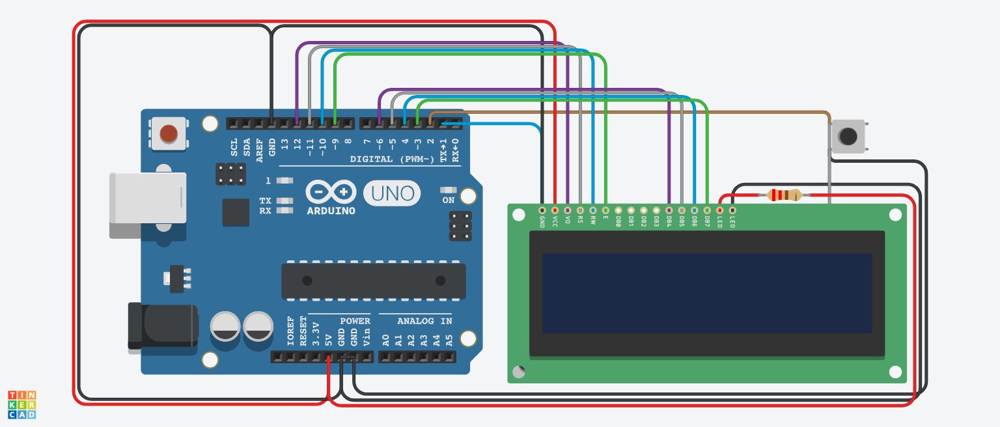

# Obstacle Avoidance Game using Arduino

## AIM:

Implementing Obstacle Avoidance Game using Arduino.

## Purpose:

To implement obstacle avoidance game using Arduino.

## Short Description:

**Requirements:**

- 1 Arduino UNO
- 1 LCD
- 1 PushButton
- 1 Resistor
- USB
  (Tinkercad can also be used)

## About the Game:

- This video game is about a man running and jumping over obstacles and avoiding them.
- The object of this game is about getting as many points as possible i.e. one point for every second you are on the course and avoiding the obstacles.

## Workflow:

- We use [this](https://omerk.github.io/lcdchargen/) website to create the character(HERO) and the obstacles.
- We define the various graphics in the game using initializeGraphics() function.
- We control the movement of the terrain using the advanceTerrain() function.
- We display the position of the hero and decide terrain position using the drawHero() function.
- The pushbutton is used as an interrupt to change the position of the hero.
- The game logic like shifting terrain to left,making new terrain and game over conditions are implemented in the loop().
- Thus, we can create an Obstacle Avoidance game using Arduino.

## Setup instructions:

- Assemble the circuit as shown below.
- Make sure to connect one end of the LCD and pushbutton to ground(i.e. GND)
- Upload the code provided [here](./obstacle_avoidance_using_arduino.ino)
- Run to see the project in action!

---

## Output:

[Simulation Video](https://github.com/shreya024/IoT-Spot/blob/main/Minor%20Scripts/Arduino/Obstacle%20Avoidance%20Game/Images/obstacle_avoidance_game.mp4)

---

## Author:

[Shreya Ghosh](https://github.com/shreya024)
